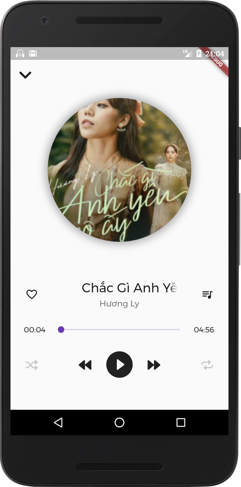

# Temposcape player

<p float="left">
    
    
    
</p>

[View all screenshots](docs/screenshots.md)


A music player written in Flutter.

[](https://github.com/dqhieuu/temposcape_player/actions/workflows/flutter_android.yml)


## Usage
First generate the .g files for i18n files:
```
pub run build_runner build
```

## Distribution
To build .apk file, run:
```
flutter build apk
```

## More info about this app
Read more in this presentation: https://rb.gy/fjzzot